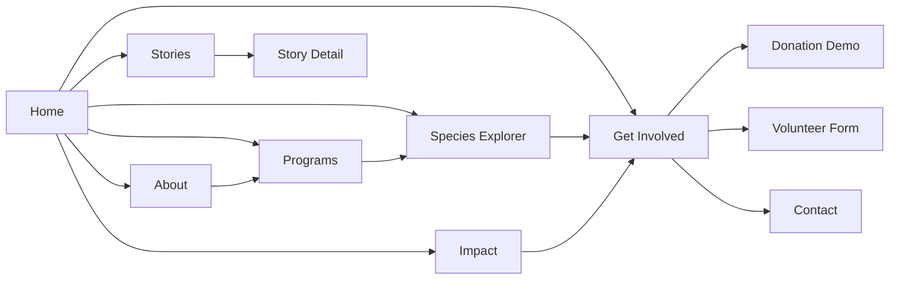
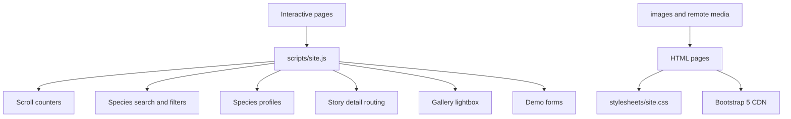

# APC Americas

### Animal Preservation Centre | Wildlife, habitats, and communities

<p align="center">
  <strong>A polished multi-page conservation website built with semantic HTML, custom CSS, Bootstrap 5, and vanilla JavaScript.</strong>
</p>

<p align="center">
  <a href="index.html">Explore the website</a> &nbsp; | &nbsp;
  <a href="species.html">Meet the species</a> &nbsp; | &nbsp;
  <a href="get_involved.html">Get involved</a>
</p>

---

## The Experience

APC Americas presents a premium, editorial-style wildlife conservation experience. Visitors can move from inspiration to action through a clear path:

> **Discover the mission -> Explore the work -> Meet protected species -> Read field stories -> See impact -> Take action**

The design preserves the existing visual identity:

| Element | Direction |
| --- | --- |
| Primary color | Deep forest green for trust and conservation |
| Accent | Golden yellow for energy and calls to action |
| Background | Cream and off-white surfaces for warmth |
| Type | Serif display headings with clean sans-serif body text |
| Components | Spacious layouts, white panels, rounded corners, subtle shadows |
| Motion | Quiet reveal animations, hover elevation, and count-up statistics |

> **Content note:** Statistics, team details, contact information, and field stories are demonstration content. Replace them with verified APC data before launch.

## Website Flow



## Page Map

| Page | Purpose | Key interaction |
| --- | --- | --- |
| [Home](index.html) | Introduces the mission and directs visitors into the site | Animated counters, newsletter demo, media embeds |
| [About Us](about_us.html) | Explains the story, vision, values, and working region | Mission panels and support-use visualisation |
| [Programs](programs.html) | Explains conservation programs and the working model | Program cards and Discover -> Protect -> Restore -> Monitor -> Recover timeline |
| [Species Explorer](species.html) | Makes protected species searchable and browsable | Search, category filters, and dynamic species profiles |
| [Impact](impact.html) | Shows demonstration outcomes and milestones | Animated statistics, timeline, and impact bars |
| [Stories](stories.html) | Shares editorial conservation stories | Story cards leading to dedicated detail pages |
| [Story Detail](story_detail.html?story=forests) | Displays an individual story selected by URL | Query-string driven article content |
| [Gallery](gallery.html) | Presents field and wildlife imagery | Click-to-open lightbox with caption |
| [Get Involved](get_involved.html) | Converts interest into participation | Donation demo and validated volunteer form |
| [Contact](contact_us.html) | Provides locations and a contact route | Responsive table, inquiry form, and map placeholder |
| [Confirmation](confirmation.html) | Confirms a submitted inquiry | Return-home action |

## Architecture



### Repository layout

```text
.
├── index.html
├── about_us.html
├── programs.html
├── species.html
├── impact.html
├── stories.html
├── story_detail.html
├── gallery.html
├── get_involved.html
├── contact_us.html
├── confirmation.html
├── images/
│   ├── baby-snow-leopard.jpg
│   └── random-logo-png-transparent.png
├── scripts/
│   └── site.js
└── stylesheets/
    └── site.css
```

## Interaction Model

### Species Explorer

Species cards carry structured `data-*` attributes. `scripts/site.js` uses those values to:

1. Match search text against visible species content.
2. Filter by animal class or conservation status.
3. Populate the profile panel without leaving the page.
4. Scroll the selected profile into view.

### Story Detail Pages

Each story card links to the same reusable page with a different query string:

```text
story_detail.html?story=forests
story_detail.html?story=rescue
story_detail.html?story=habitat
story_detail.html?story=community
```

The JavaScript selects the matching article data, image, field note, and page title.

### Forms and Donations

The donation and volunteer experiences are front-end demonstrations only:

- Donation amounts update the selected value.
- One-time and monthly options are displayed.
- No payment gateway or financial data processing is implemented.
- Volunteer and newsletter forms use browser validation plus an in-page success state.

## Local Development

This is a static website and does not require a build step or package installation.

```bash
git clone https://github.com/Vikasingh99/intro-to-web-design-udemy.git
cd intro-to-web-design-udemy
```

Then open `index.html` in a browser, or serve the folder with any static server:

```bash
python3 -m http.server 8000
```

Visit `http://localhost:8000`.

The site uses these external resources at runtime:

- Bootstrap 5.3.3 CSS and JavaScript from jsDelivr
- YouTube embeds on the home page
- Unsplash image URLs on the Species, Stories, and Gallery pages

For offline use, download those assets and update the references to local files.

## Implementation Notes

- **HTML:** semantic page sections, labelled inputs, descriptive image alt text, and accessible navigation labels.
- **CSS:** one shared stylesheet extends the original forest-green, cream, gold, serif-led system.
- **JavaScript:** one dependency-free script handles counters, filters, profiles, story routing, lightbox behavior, and demo forms.
- **Bootstrap:** used for responsive grids, navigation collapse, spacing utilities, forms, and ratio containers.
- **Responsive behavior:** layouts collapse at tablet and mobile widths; tables scroll within their own containers rather than creating page-wide horizontal scroll.

## Production Checklist

Before publishing a real conservation organization site:

- Replace all demonstration figures with verified impact data.
- Replace placeholder contact details and map content.
- Add real team profiles, stories, and locally hosted image assets.
- Connect forms to a secure backend or form service.
- Connect donations to a trusted payment provider.
- Add a privacy policy, terms page, cookie notice, and accessibility review.
- Test external media and image licenses for production use.

---

<p align="center"><strong>Protecting remarkable wildlife, one habitat at a time.</strong></p>
